# Ordinals Introduction

## 比特币基础

### 1.1 比特币一些特点

1. 比特币采用 POW 工作量证明。比特币的挖矿过程，就是通过计算一个难以计算的数学题，来证明自己的工作量，从而获得奖励。
2. 挖矿奖励每四年减半。比特币的挖矿奖励，每四年减半一次，最初是 50 个比特币。
3. 比特币的单位是 BTC 和 satoshis，1 BTC = 100000000 satoshis。
4. 比特币固定每 10 **分钟**产生一个区块。
5. 比特币矿工挖矿成功后，会获得比特币奖励，这个奖励通过一个特殊的 coinbase 交易发送给矿工。
6. 比特币的总量是确定的，所有的比特币都是通过挖矿产生的，没有其他的方式产生比特币。
7. 比特币上没有账户（account）的概念，只有地址（address）的概念。
8. 比特币的交易，是通过输入（Inputs）和输出（Outputs）来进行的。某个地址拥有比特币的数量不能直接获取到，需要通过计算该地址拥有的未花费交易输（UTXO）出来确定。
9. 比特币网络分为和测试网
   1. 主网称为 Mainnet 或者 Livenet
   2. 测试网有两种 Testnet 和 Signet，两者的区别在于 Signet 是一个私有的测试网，一个节点想要加入其中需要批准，而 Testnet 是一个公共的测试网，所有节点都可以加入。测试的话二者都可以，但是 Signet 更加安全，因为它是私有的，而 Testnet 是公共的，可能会有人恶意攻击。
10. 比特币交易浏览器
   1.  [blockchain.com](https://www.blockchain.com/explorer)
   2.  [blockchair.com](https://blockchair.com/bitcoin)
   3.  [blockcypher.com](https://live.blockcypher.com/btc/)
   4.  [blockstream.info](https://blockstream.info/)
   5.  [mempool.space](https://mempool.space/)
11. 比特币的交易手续费是与交易的大小有关的，交易的大小是由交易的输入和输出决定的，输入和输出的数量越多，交易的大小就越大，交易的手续费也就越高。同时，交易的手续费也与交易的优先级有关，优先级越高，手续费也就越高。交易的优先级是由交易的输入和输出的年龄决定的，年龄越大，优先级越高。因此如果你想要交易的手续费尽可能的低，那么你可以尽可能的少使用输入和输出，同时尽可能的使用年龄较大的输入和输出。

### 1.2 UTXO（Unspent Transaction Output）

UTXO（未花费交易输出）这个交易模型是理解比特币交易的关键。

#### 1.2.1 什么是 UTXO

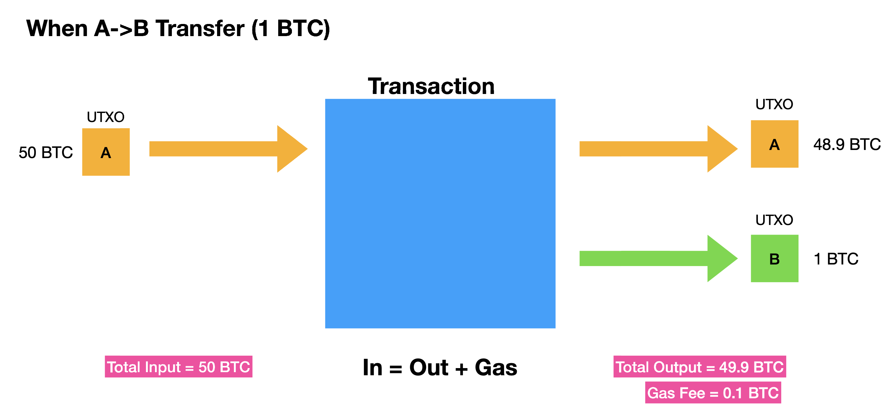

这个例子中，表示黄色代表的用户向绿色代表的用户转账 1 个比特币。这个交易的输入是 50 个 BTC。输出是一个 1 BTC 和一个 48.9 BTC。两个输出加上手续费等于输入。

其中这个 1 BTC 的输出，就是一个 UTXO。表示现在这一个比特币还没有花出去。当绿色用户想要花费这个 1 BTC 的时候，就会从 UTXO 集合中找到这个 UTXO，然后将这个 UTXO 作为输入，构建一个新的交易。

#### 1.2.2 UTXO 集合

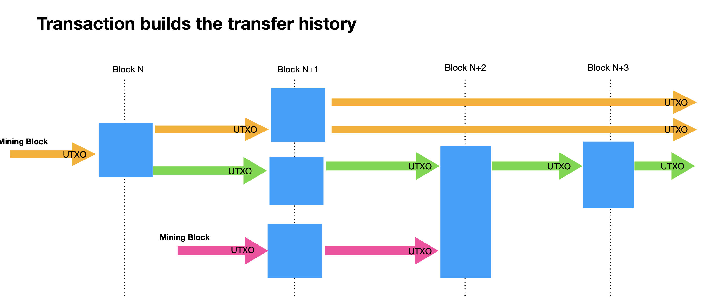

这个图表示了不同的 UTXO 之间的关系。

所有的比特币节点都需要维护一个 UTXO 集合。集合里是所有的 UTXO。

随着交易的增加，UTXO 集合也在不断变化。当一个交易被确认后，就表示一个 UTXO 被使用，之后它就会从 UTXO 集合中移除。当新的交易创建了新的 UTXO 时，这个新的 UTXO 就会被添加到 UTXO 集合中。

可以看到这些 UTXO 之间形成了多个链条，UTXO 集合中的每一个 UTXO 都可以追溯到最终的 coinbase 交易，这些链条就是比特币的交易链条。

由于维护这个 UTXO 集合是比较耗费资源的，因此比特币的节点倾向于维持尽量小的 UTXO 集合。因此有两个特性需要注意：

1. Uneconomical outputs and disallowed dust（不经济的输出和粉尘限制）为了防止出现过多的 UTXO。每个 UTXO 输出中的比特币数量最小值不是 1 satoshis，比特币的交易输出必须大于 546 satoshis。
2. 存在时间越长的 UTXO，在交易打包的时候优先级越高。这个优先级会影响交易的手续费。也就是说极端情况下，如果你的 UTXO 存在时间足够长，那么你可以不用支付任何手续费。

#### 1.2.3 一个地址的余额

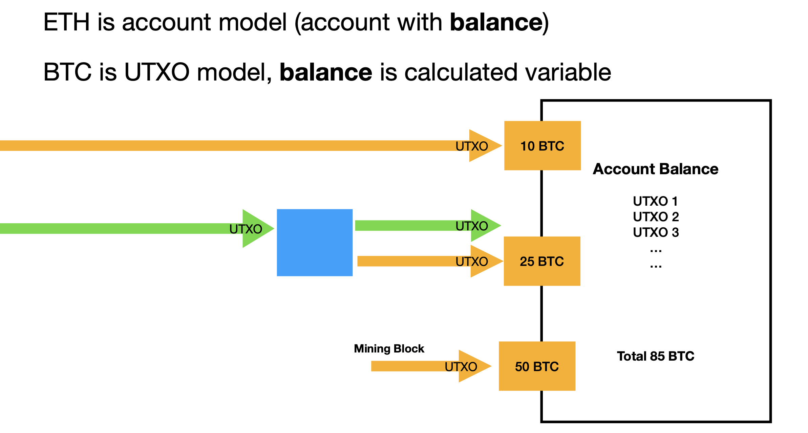

正如上面说的，一个地址的余额是由这个地址拥有的 UTXO 决定的。这一点跟以太坊的账户模型不同。

#### 1.2.4 UTXO 总结

1. UTXO 模型是比特币的核心，理解了 UTXO 模型，就理解了比特币的交易模型。
2. UTXO 让比特币的交易更像是现实世界的交易，比如你有 100 块钱，你想要给别人 50 块钱，那么你就需要找到一张 100 块钱的纸币，然后找零 50 块钱给自己，这就是 UTXO 模型。同时你的余额也是由你拥有的纸币决定的。
3. 也正是有这些特性，Ordinals（序数）才有存在的可能。

### 1.3 比特币交易

https://mempool.space/tx/8a39aa4c73cb4b87904db0f0b8c27f24b0b8b9d17bd8087b7dba7342ab8a0be8

### 1.4 比特币脚本

在上面的 UTXO 的介绍中，我们知道了比特币是如何转账的，但其实还有一个问题没有解决，那就是如何证明某个账户拥有这个 UTXO。这个问题就是比特币脚本要解决的问题。

举个最简单例子就是，A 要给 B 转账 1 BTC，那么 A 就会将这个 UTXO 锁定在一个脚本中，这个脚本的内容是：只有 B 才能花费这个 UTXO。当 B 想要花费这个 UTXO 的时候，就需要提供一个脚本，这个脚本的内容是：我就是 B。如果这个脚本和之前的脚本匹配，那么这个 UTXO 就可以被花费。

因此根据功能的不同，比特币脚本可以分为两类：锁定脚本（Locking Script）和解锁脚本（Unlocking Script）。锁定脚本用来锁定 UTXO，解锁脚本用来解锁 UTXO。

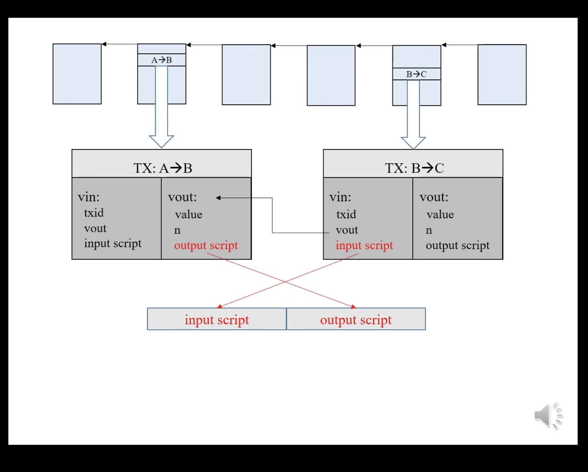

当交易创建的时候，需要先从当前地址的 UTXO 中找到足够支付的 UTXO，然后生成一个交易，这个交易包含了输入和输出。输入中包含了之前的 UTXO，输出中包含了新的 UTXO。同时还需要提供一个解锁脚本，这个解锁脚本用来解锁之前的 UTXO。当这个交易被打包的时候，就会将之前的 UTXO 中的锁定脚本和解锁脚本合并执行。如果执行成功没有错误就说明解锁成功，那么这个交易就会被确认，才会被打包到新的区块中。

比特币脚本使用一种称为 "堆栈" 的数据结构来执行。脚本中的每个元素（操作码或数据）按顺序执行。数据被推入堆栈，操作码则对堆栈中的数据进行操作。

比特币脚本语言是不完全图灵完备的，这意味着它没有循环和其他一些复杂的控制结构。这是为了防止脚本执行时间过长或者无限循环，从而影响比特币网络的稳定性。

#### 1.4.1 类型

根据解锁方式的不同比特币脚本主要有以下几种类型：

##### 1. P2PK (Pay-to-Public-Key)：

这是比特币最早的交易类型，直接向公钥支付。在这种类型的交易中，输出脚本包含接收者的公钥和 OP_CHECKSIG 操作码。输入脚本包含数字签名。当输入脚本和输出脚本合并并执行时，如果数字签名与公钥匹配，那么交易就被视为有效。

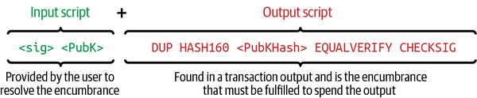

##### 2. P2PKH (Pay-to-Public-Key-Hash)

这是比特币最常见的交易类型，向公钥的哈希支付。在这种类型的交易中，输出脚本包含 OP_DUP、OP_HASH160、接收者公钥的哈希、OP_EQUALVERIFY 和 OP_CHECKSIG 操作码。输入脚本包含数字签名和公钥。当输入脚本和输出脚本合并并执行时，如果公钥的哈希与输出脚本中的哈希匹配，并且数字签名与公钥匹配，那么交易就被视为有效。

```
<Sig> <Pubkey> OP_DUP OP_HASH160 <Hash> OP_EQUALVERIFY OP_CHECKSIG
```

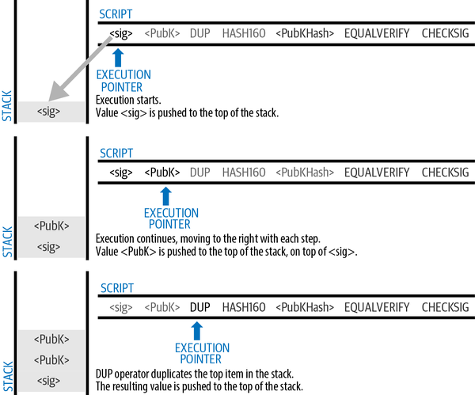
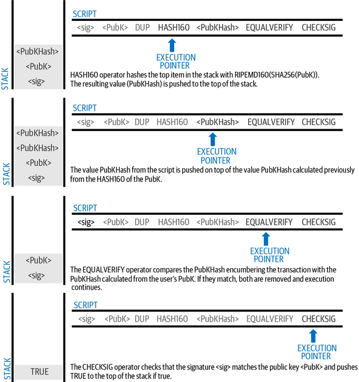

##### 3. P2SH (Pay-to-Script-Hash)

上面两种类型对于转账等简单操作来说比较好用，但是如果想要实现更复杂的操作，比如多签名的时候就会因为脚本的复杂度而导致交易费用和 UTXO 的体积过大，从而造成一系列的问题。这个时候就需要使用 P2SH 交易。

这里有一个多签的的交易的脚本实现，分别是 PTPK 和 PTSH 。

```
Output script 

2 PubKey1 PubKey2 PubKey3 PubKey4 PubKey5 5 OP_CHECKMULTISIG

Input script 

Sig1 Sig2
```

```
Redeem script 

2 PubKey1 PubKey2 PubKey3 PubKey4 PubKey5 5 OP_CHECKMULTISIG

Output script 

OP_HASH160 <20-byte hash of redeem script> OP_EQUAL

Input script 

Sig1 Sig2 <redeem script>
```

##### 4. P2WPKH (Pay-to-Witness-Public-Key-Hash) 和 P2WSH (Pay-to-Witness-Script-Hash)：

这两种类型的交易是隔离见证（SegWit）的一部分，它们分别是 P2PKH 和 P2SH 的隔离见证版本。这些交易类型的主要区别在于它们将签名和其他见证数据从交易的输入部分移动到了一个新的“见证”部分，这可以解决交易可塑性问题，提高交易的效率，并使得比特币网络可以支持更大的交易量。

##### 5. Taproot

Taproot 是比特币的一个新的交易类型，它可以将多种交易类型合并到一个交易中，从而提高比特币的隐私性。Taproot 交易的输出脚本包含了一个 Merkle 树的根哈希，这个 Merkle 树包含了多种交易类型的脚本。当交易被打包的时候，会根据输入脚本中的数据来决定使用哪个脚本。

taproot 中引入了许多新的操作码，这些操作码可以用来实现更多的功能，比如多签、时间锁等。这些被称为 taproot script。

### 1.5 比特币地址

比特币地址通常是由比特币脚本的哈希值经过 Base58Check 或 Bech32 编码得到的。不同类型的脚本对应的地址也不同，这是因为不同的脚本类型有不同的哈希和编码规则。

例如，P2PKH（Pay-to-Public-Key-Hash）地址是由公钥的 SHA-256 和 RIPEMD-160 哈希值经过 Base58Check 编码得到的，地址以数字 1 开头。P2SH（Pay-to-Script-Hash）地址是由脚本的 SHA-256 和 RIPEMD-160 哈希值经过 Base58Check 编码得到的，地址以数字 3 开头。

隔离见证（SegWit）地址则使用了一种新的编码方案，称为 Bech32。P2WPKH（Pay-to-Witness-Public-Key-Hash）和 P2WSH（Pay-to-Witness-Script-Hash）地址是由公钥或脚本的 SHA-256 哈希值经过 Bech32 编码得到的，地址以 "bc1" 开头。

支持不同的脚本类型和对应的地址是比特币协议的一个重要特性，它使得比特币可以支持各种各样的交易类型和使用场景。不同的脚本类型和地址类型有各自的优点和用途，例如 P2PKH 地址简单易用，P2SH 地址可以支持复杂的多签名交易，而 SegWit 地址则可以提高交易的效率并解决交易可塑性问题。

## 2. Inscription（铭文）and Inscribe（铭刻）

### 2.1 Ordinals（序数）

https://docs.ordinals.com/zh/introduction.html

理解铭文之前首先要先理解 Ordinals 这个概念。

在上面我们了解到由于比特币的 UTXO 模型的特性，所有的的比特币都可以通过 UTXO 来追溯到 coinbase 交易。而由于所有的 coinbase 都是所在区块的第一笔交易，而且一个区块只有一个 coinbase 交易。因此所有的比特币都可以按照区块的顺序进行排序，这个排序就是 Ordinals。

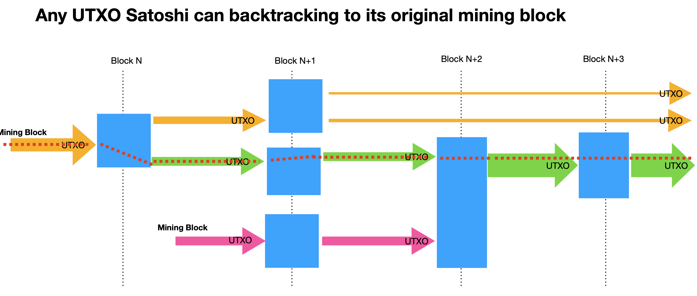

同时，由于 1 BTC 等于 100000000 satoshis，所以按照这个理论所有的 satoshis 都有了一个编号称之为序号。

序号有几种不同的表示方式：

* 整数符号:2099994106992659 这个序号是根据挖掘聪的顺序分配。

* 十进制符号: 3891094.16797 第一个数字是挖掘聪的区块高度，第二个数字是区块内聪的偏移量。

* 度数符号: 3°111094′214″16797‴。

```
A°B′C″D‴
│ │ │ ╰─ Index of sat in the block
│ │ ╰─── Index of block in difficulty adjustment period
│ ╰───── Index of block in halving epoch
╰─────── Cycle, numbered starting from 0
```

* 百分数: 99.99971949060254% . 以百分比表示聪在比特币供应中的位置

* 名字: satoshi. 一种使用字母 a 到 z对序号进行编码的方法，举个例子, 1905530482684727°'的名字是 "iaiufjszmoba"。

Ordinals 的转移

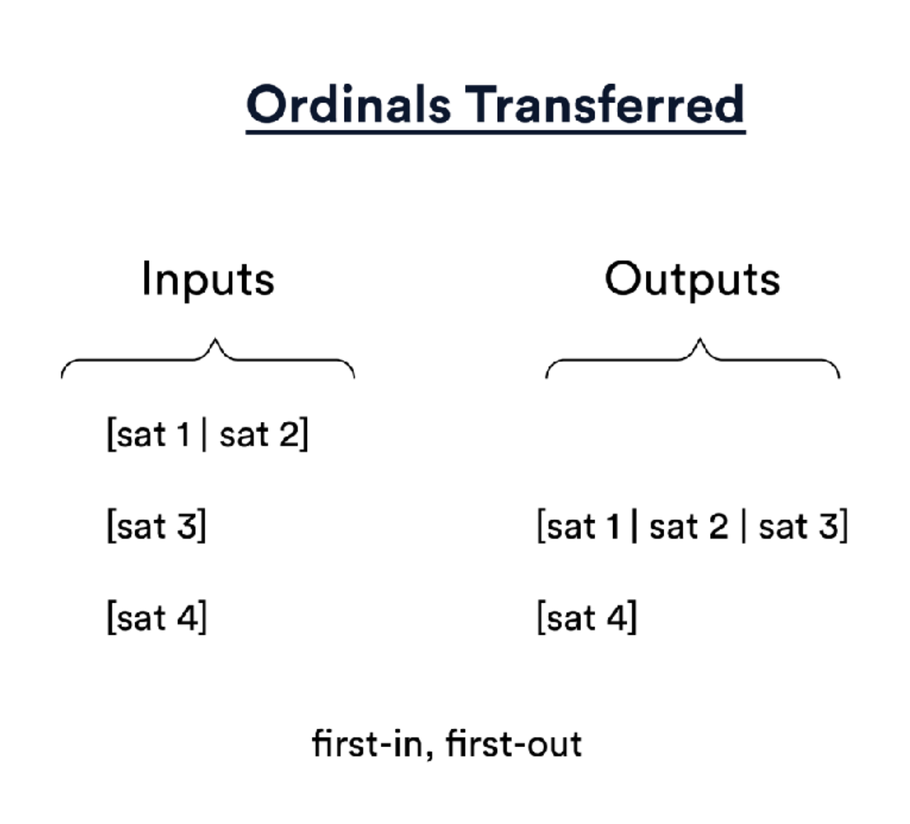

### 2.2 铭文

Ordinals 协议有很多应用，比如稀有聪，稀有的名字等等。这些都是通过 Ordinals 协议来实现的。不过最近 Ordinals 协议的最大的应用就是铭文。

铭文是一种将数据铭刻到比特币区块链上的方法。铭文的数据可以是任意的，可以是文本、图片、视频等等。

简单来说就是在比特币脚本中嵌入数据，然后将这个脚本锁定在一个 UTXO 中，这个 UTXO 就是一个铭文。

比如包含字符串“Hello, world!”的文本铭文 序列化如下：

```
OP_FALSE
OP_IF
  OP_PUSH "ord"
  OP_PUSH 1
  OP_PUSH "text/plain;charset=utf-8"
  OP_PUSH 0
  OP_PUSH "Hello, world!"
OP_ENDIF
```

首先字符串 `ord` 表示序数协议。

`OP_PUSH 1` 表示后面内容是数据的 MIME 类型。

`OP_PUSH 0` 表示后续数据推送包含内容本身。对于大型铭文必须使用个片段拼接。

外围的 `OP_FALSE OP_IF … OP_ENDIF` 称为信封，从操作符本身的含义来说这段是无意义的，这段逻辑不会被脚本执行。但是通过这种方式将铭文内容的数据保存到了比特币区块信息中。

### 2.3 铭文的应用

比较流行的铭文应用有两个，一个是 NFT，另一个是 BRC20。

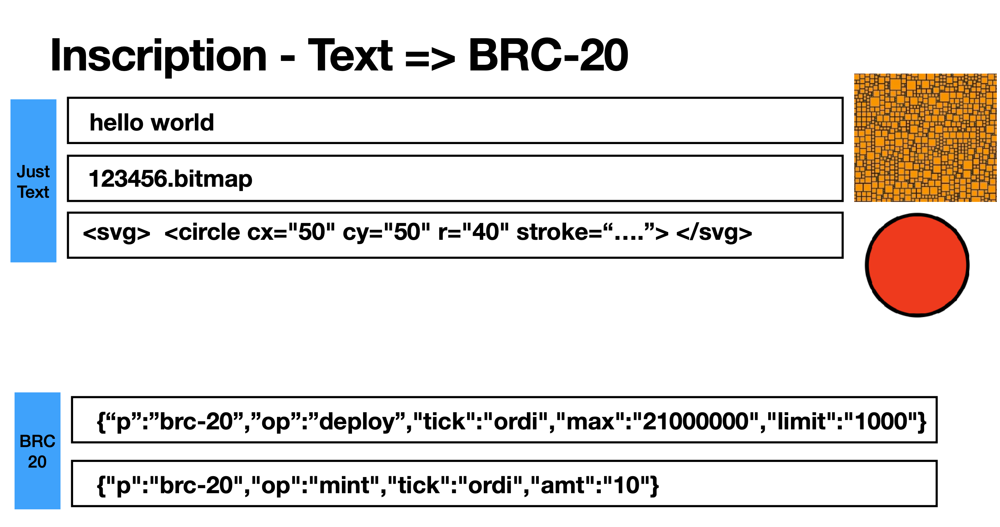

#### 2.3.1 NFT

其实从本质上来说所有铭刻的内容都可以看成是 NFT，比如纯文本的铭文，也可以看成是一个文本 NFT。不过在更狭义的定义中，提到 比特币的 NFT 的时候，通常指的是图片。

#### 2.3.2 BRC20

BRC20 铭刻的是一种特定格式的字符串，这个字符串包含了一些特定的信息，比如合约地址、发行总量、名称、符号等等。这些信息可以用来表示一个 BRC20 代币。

根据功能的不同，BRC20 的铭刻内容可以分为以下几种：

##### 1. 发行

```
{ 
  "p": "brc-20",
  "op": "deploy",
  "tick": "ordi",
  "max": "21000000",
  "lim": "1000"
}
```

##### 2. 铸造

```
{ 
  "p": "brc-20",
  "op": "mint",
  "tick": "ordi",
  "amt": "100"
}
```

##### 3. 转账

```
{ 
  "p": "brc-20",
  "op": "transfer",
  "tick": "ordi",
  "amt": "100"
}
```

##### 流程

还有一点需要注意的是，这些铭刻是没有限制的，任何人任何时候都可以进行铭刻。如果两个人 deploy了同样的 BRC20 代币，只从比特币交易的层面来看，这两个是完全一样的。

因此需要一个索引器来对这些铭刻的行为进行索引。 索引器会按照一定的规则对所有的铭刻的交易进行索引。

这个规则可以是这样的：

1. 代币的名称是唯一的，如果有两个代币的名称相同，那么只有最早的一个会被索引，后面的都会被忽略。
2. 根据 mint 的铭刻计算某个地址的余额。
3. 根据 transfer 的铭刻计算某个地址的转账记录。如果没有 mint 就进行 transfer 的话，那么这个铭刻交易会被忽略。
4. ...

这些规则可能会有很多，而且每一个索引器的规则都可能不一样。目前最流行的是 Unisat 和 OKX 的这两个中心化的索引器。也有一些去中心化的索引器正在创建。

下面是一个大致的流程：

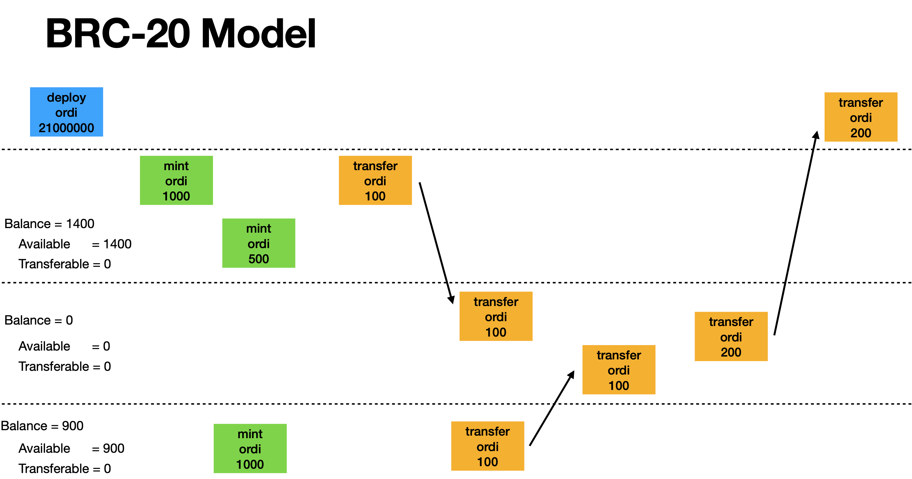

### 2.4 铭刻 

铭刻是指将数据铭刻到比特币区块链上的行为。

铭文内容完全在链上，存储在 taproot script-path spend脚本中。 Taproot 脚本对其内容的限制很少，并且额外获得见证折扣，使得铭文内容存储相对经济。

由于 taproot script-path spend 脚本只能从现有的 taproot 输出中产生，因此使用两阶段 commit/reveal 过程进行铭刻。首先，在commit中，创建一个提交到包含铭文内容的脚本的 taproot 输出。 其次，在 reveal 交易中，使用 commit 交易产生的输出，来显示链上的铭文内容。

我们可以从一个铭文的例子中两个具体的交易来看一下铭刻的过程。

https://testnet.ordinals.com/inscription/8a6a54d1bea3fb72bf590bcc9d33fba95c9db95bccf97724de3a67ff149f063fi0

#### 2.4.1 Commit

https://mempool.space/testnet/tx/3171a42b09f838886625b43cb65d3f894e161e6aabe8029b3f21e20032caac32

```json
{
    "txid": "3171a42b09f838886625b43cb65d3f894e161e6aabe8029b3f21e20032caac32", // 交易的唯一标识符
    "version": 2, // 交易数据格式的版本号
    "locktime": 0, // 交易的锁定时间，0 表示没有锁定时间
    "vin": [ // 交易的输入列表
        {
            "txid": "857a7d356dfa1df3dee75e3502540635966a3ec86dc8cc48a31ddaa39a5dc1c4", // 输入引用的交易的 ID
            "vout": 1, // 输入引用的交易的输出索引号
            "prevout": { // 输入引用的交易的输出详情
                "scriptpubkey": "0014652f2dc106c4f3965c3ef3d62068c17d0a4d8c6b", // 锁定脚本
                "scriptpubkey_asm": "OP_0 OP_PUSHBYTES_20 652f2dc106c4f3965c3ef3d62068c17d0a4d8c6b", // 锁定脚本的汇编表示
                "scriptpubkey_type": "v0_p2wpkh", // 锁定脚本的类型
                "scriptpubkey_address": "tb1qv5hjmsgxcneevhp770tzq6xp059ymrrt7a4xtw", // 锁定脚本对应的地址
                "value": 653914 // 锁定脚本锁定的比特币数量，单位是聪
            },
            "scriptsig": "", // 解锁脚本
            "scriptsig_asm": "", // 解锁脚本的汇编表示
            "witness": [ // 隔离见证数据
                "304402201c649dfe270b8760d4c7735b1b54d13b8e39ecd95e8058e2ed6aac23f262c1120220559bdf214caafeffdc9b05ca55f5e7b842a257235d2c1ca2ddbf7c23d7cdbe2a01",
                "02d2ccf399ac8d665e1b7f22f40f2bad7e3f6fa2fca0187913484051c68fb165c1"
            ],
            "is_coinbase": false, // 是否是 coinbase 交易
            "sequence": 4294967295 // 输入的序列号
        }
    ],
    "vout": [ // 交易的输出列表
        {
            "scriptpubkey": "51201af0e57fe73b4e3e0d743934ef7971408e07679c44f88dbb33acc66c9302af7b", // 锁定脚本
            "scriptpubkey_asm": "OP_PUSHNUM_1 OP_PUSHBYTES_32 1af0e57fe73b4e3e0d743934ef7971408e07679c44f88dbb33acc66c9302af7b", // 锁定脚本的汇编表示
            "scriptpubkey_type": "v1_p2tr", // 锁定脚本的类型
            "scriptpubkey_address": "tb1prtcw2ll88d8rurt58y6w77t3gz8qweuugnugmwen4nrxeycz4aashxdhkq", // 锁定脚本对应的地址
            "value": 2040 // 锁定脚本锁定的比特币数量，单位是聪
        },
        {
            "scriptpubkey": "0014652f2dc106c4f3965c3ef3d62068c17d0a4d8c6b", // 锁定脚本
            "scriptpubkey_asm": "OP_0 OP_PUSHBYTES_20 652f2dc106c4f3965c3ef3d62068c17d0a4d8c6b", // 锁定脚本的汇编表示
            "scriptpubkey_type": "v0_p2wpkh", // 锁定脚本的类型
            "scriptpubkey_address": "tb1qv5hjmsgxcneevhp770tzq6xp059ymrrt7a4xtw", // 锁定脚本对应的地址
            "value": 651721 // 锁定脚本锁定的比特币数量，单位是聪
        }
    ],
    "size": 234, // 交易的大小，单位是字节
    "weight": 609, // 交易的权重，用于计算交易费
    "sigops": 1, // 交易的签名操作数量，用于计算交易费
    "fee": 153, // 交易费，单位是聪
    "status": { // 交易的状态
        "confirmed": true, // 是否已确认
        "block_height": 2575734, // 包含该交易的区块的高度
        "block_hash": "00000000047024b28361395a35466d347b6c27125033b2d028b9031d57a3950a", // 包含该交易的区块的哈希值
        "block_time": 1706245929 // 包含该交易的区块的时间戳
    }
}
```

#### 2.4.2 Reveal

https://mempool.space/testnet/tx/8a6a54d1bea3fb72bf590bcc9d33fba95c9db95bccf97724de3a67ff149f063f

```json
{
    "txid": "8a6a54d1bea3fb72bf590bcc9d33fba95c9db95bccf97724de3a67ff149f063f",  // 交易的唯一标识符，也称为交易哈希
    "version": 2,  // 交易数据结构的版本号
    "locktime": 0,  // 交易的锁定时间。如果非零，表示交易直到指定的区块高度或时间戳才能被添加到区块链中
    "vin": [  // 输入交易列表
        {
            "txid": "3171a42b09f838886625b43cb65d3f894e161e6aabe8029b3f21e20032caac32",  // 输入交易的ID
            "vout": 0,  // 输入交易的输出序号
            "prevout": {  // 输入交易的输出详情
                "scriptpubkey": "51201af0e57fe73b4e3e0d743934ef7971408e07679c44f88dbb33acc66c9302af7b",  // 锁定脚本
                "scriptpubkey_asm": "OP_PUSHNUM_1 OP_PUSHBYTES_32 1af0e57fe73b4e3e0d743934ef7971408e07679c44f88dbb33acc66c9302af7b",  // 锁定脚本的汇编表示
                "scriptpubkey_type": "v1_p2tr",  // 锁定脚本的类型
                "scriptpubkey_address": "tb1prtcw2ll88d8rurt58y6w77t3gz8qweuugnugmwen4nrxeycz4aashxdhkq",  // 锁定脚本对应的地址
                "value": 2040  // 输入交易的输出的价值，单位是聪
            },
            "scriptsig": "",  // 解锁脚本
            "scriptsig_asm": "",  // 解锁脚本的汇编表示
            "witness": [  // 见证数据，用于隔离见证交易
                "3cea55328b3afc91dab153a5a158e8b721fb76dfa89d5ac217178c261c2c77708895d03771ff332655af808d6b054b14e43e5365c6425bdc672e0a1fe98a39f9",
                "20a06041ffaa03c483cf8d0bf4cfb8dfdd5bd7160c0798fad206520e2d34f0e8e1ac0063036f726401010a746578742f706c61696e00135468697320697320612074657374207465787468",
                "c1a06041ffaa03c483cf8d0bf4cfb8dfdd5bd7160c0798fad206520e2d34f0e8e15c08344cf74d7ed36ce439d1ba82adff9566016e7c0e819c42d1e0898d18cbc0"
            ],
            "is_coinbase": false,  // 是否为coinbase交易，coinbase交易是每个区块的第一个交易，用于给矿工奖励
            "sequence": 4294967293,  // 序列号，用于标识交易的可替换性
            "inner_witnessscript_asm": "OP_PUSHBYTES_32 a06041ffaa03c483cf8d0bf4cfb8dfdd5bd7160c0798fad206520e2d34f0e8e1 OP_CHECKSIG OP_0 OP_IF OP_PUSHBYTES_3 6f7264 OP_PUSHBYTES_1 01 OP_PUSHBYTES_10 746578742f706c61696e OP_0 OP_PUSHBYTES_19 54686973206973206120746573742074657874 OP_ENDIF"  // 内部见证脚本的汇编表示
        }
    ],
    "vout": [  // 输出交易列表
        {
            "scriptpubkey": "0014652f2dc106c4f3965c3ef3d62068c17d0a4d8c6b",  // 锁定脚本
            "scriptpubkey_asm": "OP_0 OP_PUSHBYTES_20 652f2dc106c4f3965c3ef3d62068c17d0a4d8c6b",  // 锁定脚本的汇编表示
            "scriptpubkey_type": "v0_p2wpkh",  // 锁定脚本的类型
            "scriptpubkey_address": "tb1qv5hjmsgxcneevhp770tzq6xp059ymrrt7a4xtw",  // 锁定脚本对应的地址
            "value": 1500  // 输出的价值，单位是聪
        }
    ],
    "size": 292,  // 交易的大小，单位是字节
    "weight": 538,  // 交易的权重，用于计算交易费
    "sigops": 0,  // 交易的签名操作数，用于限制区块的大小
    "fee": 540,  // 交易费，单位是聪
    "status": {  // 交易的状态
        "confirmed": true,  // 是否已确认
        "block_height": 2575734,  // 包含该交易的区块的高度
        "block_hash": "00000000047024b28361395a35466d347b6c27125033b2d028b9031d57a3950a",  // 包含该交易的区块的哈希
        "block_time": 1706245929  // 包含该交易的区块的时间戳
    }
}
```
